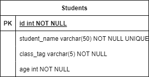

# Projeto para a Challenge Week Resilia

Código para o Challenge Week September da Resilia.


## [Backend](./backend/)

Backend feito em Python utilizando FastAPI com CRUD e testes para estudantes.

### Rodando localmente

Necessário Python 3.10+

1. Vá para o diretório do backend, crie um ambiente virtual e instale as dependências
```bash
cd backend
source venv/bin/active
pip install -r requirements.txt
```

2. Inicie o servidor
```bash
uvicorn app.main:app --port 5001
```

3. Acesse [http://localhost:5001/docs](http://localhost:5001/docs) para ter acesso ao Swagger da aplicação.

#### Testes

Execute o seguinte comando para rodar os testes
```bash
pytest
```


## [Frontend](./frontend/)

Frontend feito em React utilizando vite.

### Rodando localmente

Necessário Node 16+

**Mude o nome do arquivo .env.example para .env**

1. Vá para o diretório do frontend, instale as depêndencias e rode o servidor
```bash
cd frontend
yarn # ou npm install
yarn dev # ou npm run dev
```

2. Acesse [http://localhost:3001](http://localhost:3001)


## Diagrama ER e queries



- [Queries](./docs/selects.sql)
